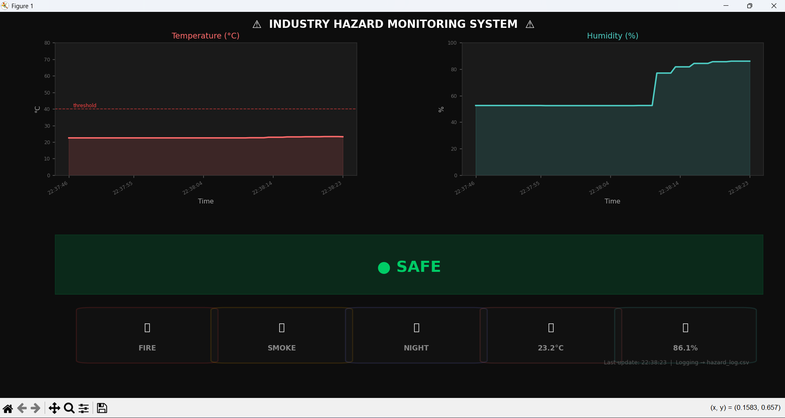

# industry-hazard-detection
Multi-sensor industrial hazard detection system with Arduino, sensor fusion logic, real-time Python dashboard, and automated Excel logging.

# Industry Hazard Detection System

A real-time multi-sensor hazard monitoring system built on Arduino UNO, with a Python-based dashboard and intelligent Excel event logging. Designed as a low-cost proof-of-concept mirroring SCADA-style two-layer monitoring architecture.

## What It Does

- Monitors fire, gas/smoke, temperature, humidity, and ambient light simultaneously
- Implements **sensor fusion** — fire alert triggers only when IR flame detection AND temperature > 40°C, eliminating false alarms from sunlight or TV remotes
- Streams sensor data over USB serial to a Python dashboard with live rolling graphs and a three-tier alert system (SAFE / WARNING / CRITICAL)
- Logs only anomalous events (fire, gas, temperature spikes, day/night transitions) to Excel with per-session sheets for post-incident analysis
- Two-layer architecture: LCD for on-floor operator, Python dashboard for remote supervisor

## Hardware

| Component | Role |
|---|---|
| Arduino UNO (ATmega328P) | Central microcontroller |
| DHT11 | Temperature & humidity |
| IR Flame Sensor (LM393) | Flame detection (760–1100nm) |
| MQ-2 Gas Sensor | LPG, CO, smoke detection |
| LDR Module | Ambient light / day-night detection |
| 16x2 I2C LCD | On-site display |
| Active Buzzer | Audio alert |

## Software Stack

- **Arduino IDE** — sensor reading, fusion logic, serial transmission at 9600 baud
- **Python 3** — `pyserial`, `matplotlib`, `openpyxl`, `collections.deque`

## How to Run

1. Upload `hazard_detection.ino` to Arduino UNO via Arduino IDE
2. Connect Arduino to laptop via USB
3. Run `dashboard.py` — update the `COM` port / `/dev/tty` path to match your system
4. Dashboard auto-starts; Excel log file is created in the same directory

   ## Project Setup

## Key Design Decisions

- Sensor fusion reduces alarm fatigue — a documented real-world problem in industrial safety systems
- Event-driven logging (not continuous) keeps logs clean and meaningful
- Rolling 60-second graph window gives operators actionable context without overwhelming the display
